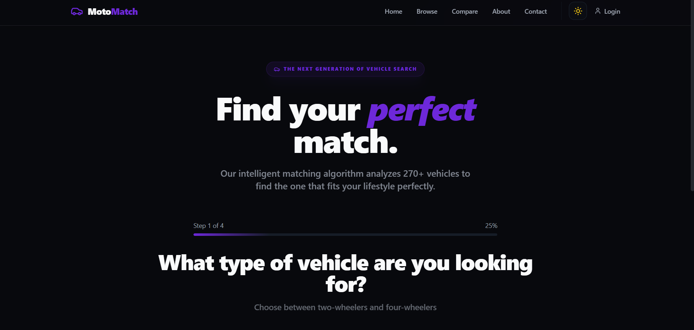

# 🏎️ MotoMatch

<p align="center">
  <b>Stop searching. Start matching your perfect ride.</b><br/>
  Intelligent vehicle recommendations for bikes & cars 🚀
</p>

<p align="center">
  
  
  
  
  
</p>

---

## 📋 Table of Contents

- [About](#-about-the-project)
- [Features](#-features)
- [Tech Stack](#-tech-stack)
- [Prerequisites](#-prerequisites)
- [Getting Started](#-getting-started)
- [Available Scripts](#-available-scripts)
- [How It Works](#-how-it-works)
- [Project Structure](#-project-structure)
- [Pages & Routes](#-pages--routes)
- [Screenshots](#-screenshots)
- [Live Demo](#-live-demo)
- [Contributing](#-contributing)
- [License](#-license)

---

## ✨ About the Project

**MotoMatch** is a modern, intelligent web application that helps users discover their perfect vehicle match. Whether you're looking for a **2-wheeler 🏍️** or **4-wheeler 🚗**, our smart recommendation system takes the guesswork out of vehicle selection.

Simply answer a few questions about your budget, preferences, and usage needs, and let MotoMatch suggest the best options tailored just for you.

---

## 🚀 Features

- 🔍 **Smart Recommendation System** - AI-powered suggestions based on user preferences
- 💸 **Budget-Based Filtering** - Find vehicles within your price range
- 🏍️ **Comprehensive Database** - 2-wheeler and 4-wheeler options
- ⚡ **Lightning-Fast Performance** - Optimized with Vite for rapid load times
- 🎨 **Beautiful UI** - Clean, modern design with Tailwind CSS
- 📱 **Fully Responsive** - Perfect experience on mobile, tablet, and desktop
- 🌙 **Dark Mode Support** - Easy on the eyes in any lighting condition
- ♿ **Accessibility First** - Built with accessibility standards in mind
- 🔄 **Vehicle Comparison** - Compare multiple vehicles side by side

---

## 🛠️ Tech Stack

| Technology | Purpose | Version |
|-----------|---------|---------|
| ⚛️ React | Frontend UI Framework | 18+ |
| ⚡ Vite | Lightning-fast build tool | Latest |
| 🎨 Tailwind CSS | Utility-first styling | 3+ |
| 📘 TypeScript | Type-safe JavaScript | Latest |
| 🍃 MongoDB Atlas | Cloud NoSQL Database | Cloud |
| ☁️ Cloudinary | Media Management & Storage | Cloud |
| 🚀 Render | Backend Cloud Hosting | Cloud |
| 🔒 JWT | Secure Authentication | - |

---

## ✅ Prerequisites

Before you begin, ensure you have the following installed:

- **Node.js** (v16 or higher)
- **npm** or **yarn** package manager
- **Git** for version control
- A modern web browser

To check your Node.js installation:
```bash
node --version
npm --version
```

---

## 🚀 Getting Started

### Clone the Repository

```bash
git clone https://github.com/akash-rautela/vehicle-finder.git
cd vehicle-finder
```

### Install Dependencies

```bash
npm install
```

### Set Up Environment Variables (if needed)

Create a `.env.local` file in the root directory (if applicable):

```env
VITE_API_URL=http://localhost:3000
```

### Run Development Server

```bash
npm run dev
```

The application will be available at `http://localhost:5173`

---

## 📦 Available Scripts

| Command | Description |
|---------|-------------|
| `npm run dev` | Start development server |
| `npm run build` | Build for production |
| `npm run preview` | Preview production build locally |
| `npm run lint` | Run ESLint to check code quality |

### Build for Production

```bash
npm run build
```

The optimized files will be in the `dist/` directory.

### Preview Production Build

```bash
npm run preview
```

---

## 🧠 How It Works

The Vehicle Finder uses a questionnaire-based approach to recommend vehicles:

1. **User Input** - Answer questions about budget, vehicle type, and usage patterns
2. **Data Processing** - System analyzes preferences and requirements
3. **Smart Matching** - Advanced algorithm matches user profile with vehicle database
4. **Personalized Results** - Ranked list of recommended vehicles displayed
5. **Detailed Comparison** - Users can compare specs and features side-by-side

### Recommendation Algorithm

- Budget compatibility scoring
- Feature preference matching
- Performance metrics alignment
- User requirement fulfillment

---

## 📁 Project Structure

```
src/
├── components/           # Reusable React components
│   ├── Header.tsx       # Navigation header
│   ├── Footer.tsx       # Footer section
│   ├── VehicleCard.tsx  # Vehicle display card
│   ├── QuestionnaireStep.tsx # Questionnaire steps
│   ├── ThemeToggle.tsx  # Dark/light mode toggle
│   └── ui/              # UI component library
├── pages/               # Page components
│   ├── Index.tsx        # Home page
│   ├── Browse.tsx       # Vehicle browsing page
│   ├── Compare.tsx      # Vehicle comparison page
│   ├── About.tsx        # About page
│   ├── Contact.tsx      # Contact page
│   └── NotFound.tsx     # 404 page
├── data/                # Static data
│   └── vehicles.ts      # Vehicle database
├── hooks/               # Custom React hooks
│   ├── use-theme.tsx    # Theme management
│   ├── use-mobile.tsx   # Mobile detection
│   └── use-toast.ts     # Toast notifications
├── lib/                 # Utility functions
│   └── utils.ts         # Helper functions
├── App.tsx              # Main app component
├── main.tsx             # Entry point
└── index.css            # Global styles
```

---

## 🔗 Pages & Routes

| Page | Path | Description |
|------|------|-------------|
| Home | `/` | Landing page with questionnaire |
| Browse | `/browse` | Browse all vehicles |
| Compare | `/compare` | Compare multiple vehicles |
| About | `/about` | Learn about the project |
| Contact | `/contact` | Get in touch |

---

## 📸 Screenshots



---

## 🌐 Live Demo

👉 **[Visit Vehicle Finder](https://vehicle-finder-zeta.vercel.app/)**

---

## 🤝 Contributing

We welcome contributions! Here's how you can help:

1. **Fork** the repository
2. **Create** a new branch (`git checkout -b feature/amazing-feature`)
3. **Commit** your changes (`git commit -m 'Add amazing feature'`)
4. **Push** to the branch (`git push origin feature/amazing-feature`)
5. **Open** a Pull Request

### Guidelines

- Follow the existing code style
- Write clear, descriptive commit messages
- Add comments for complex logic
- Test your changes before submitting

---

## 📄 License

This project is licensed under the MIT License - see the LICENSE file for details.

---

## 📞 Support & Feedback

Have questions or suggestions? Feel free to:
- Open an [Issue](https://github.com/akash-rautela/vehicle-finder/issues)
- Check existing [Discussions](https://github.com/akash-rautela/vehicle-finder/discussions)
- Reach out via the Contact page

---

<p align="center">
  Made with ❤️ by the Vehicle Finder team
</p>

## 🤝 Contributing

Contributions are welcome!

1. Fork the repo
2. Create a new branch
3. Make changes
4. Submit a PR 🚀

---

## 📄 License

This project is licensed under the **MIT License**

---

## 💡 Author

**Akash Rautela**

* GitHub: [https://github.com/akash-rautela](https://github.com/akash-rautela)
* LinkedIn: [https://www.linkedin.com/in/akash-singh-rautela](https://www.linkedin.com/in/akash-singh-rautela)

---

## ⭐ Support

If you like this project:

👉 Give it a **star ⭐**
👉 Share with friends

---

<p align="center">
  Made with ❤️ by Akash
</p>
```

---
